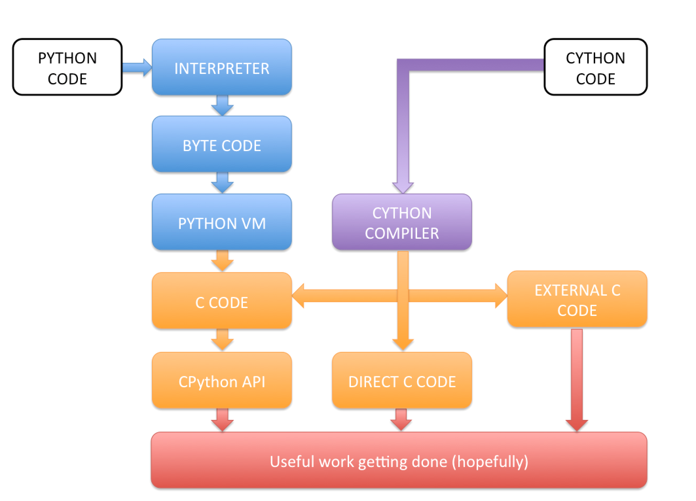

## Lesson 3: Generating optimized C code with Cython

Below are some key notes on how to use Cython to combine the best of both Python
code and C code.  See [Cython Documentation](http://docs.cython.org/index.html)
for more details on Cython syntax.



 - Cython is different from numpy and mpi4py in that it is its own programming
   language
   - Files have a `.pyx` extension instead of `.py`
   - Very similar to Python, except with optional type information
     - The `cython` program is a source-to-source compiler that generates C code
       from cython code
     - This C code uses the internal Python API to define a python module that
       is entirely C code!
     - This C code is compiled with a C compiler and linked against libpython
       into a dynamic library file (e.g.: `my_library.so`).
     - Now, any python program can `import my_library` and use the compiled
       code!
     - Cython can also embed a `main()` function, turning your entire Cython
       program into a stand-alone binary

   - Language syntax
     - Variables and functions may be declared in different ways, and may also
       contain additional type information
       - Variables:
    ```cython
    # Python int object, just like in plain python
    x = 4

    # this works fine, since x is a regular Python object
    x = '''surprise! I'm a string, now'''

    # C variable with type information
    cdef unsigned int y = 0

    # this would fail to compile, since y is a C-level variable
    y = '''surprise! I'm a string, now'''
    ```
       - Functions:
    ```cython
    # plain python function
    # works just like in python
    def do_something(x):
        ...
        return 1.2

    # same as above, except cython knows more about types
    def double do_something(unsigned long x):
        ...
        return 1.2

    # notice the use of "cdef" -- this is a cython function that is not
    # accessible from the Python interpreter
    #
    # This would get compiled into pure C code (very fast)
    cdef double do_something(unsigned long x):
        ...
        return 1.2


    # often, you want a very fast cython function, but also a small wrapper
    # function that is accessble in python.  You can use "cpdef" and have cython
    # generate the wrapper for you.  This is fast and accessible!
    cpdef double do_something(unsigned long x):
        ...
        return 1.2
    ```
       - Other syntax for C constructs:
    ```cython
    cdef:
        int A = 10
        int *pointer
        double B

    # "address of" operator
    pointer = &A

    # dereference
    *pointer = 5

    # casting
    B = <double>A
    ```
       - Calling external C code
    ```cython
    cdef extern from "stdio.h":
        void printf(char *s)

    # now, we can use the printf function from C!
    cdef int x = 10
    printf('x is equal to %d\n', x)
    ```

       - Works with any headers.  Just make sure include paths are set when
         compiling the C code.
       - Also, make sure you link in any necessary libraries.

    ```cython
    # need to make sure that you link against the math library
    cdef extern from "math.h":
        double fabs(double x)
    ...
    ```
       - Cython modules
         - Files that have cython definitions that can be imported in other
           cython files (just like a header file in C)
         - They use the `.pxd` file extension
         - Cython provides a number of modules that you can use right away
    ```cython
    # these are shortcuts for the above
    # notice the use of "cimport", the cython-level version of import
    from libc.stdio cimport printf
    from libc.math cimport fabs
    ```
       - Cython directives
         - Set various compiler options

       - file-wide setting: use a comment at the top of the file
    ```cython
    #cython: boundscheck=False
    ```

       - function-wide: use a cython decorator

    ```cython
    @cython.boundscheck(False)
    def unsafe_function(double *x):
        x[10] = ... # unsafe
    ```

       - block-wide: use a cython context manager

    ```cython
    @cython.boundscheck(False)
    def unsafe_function(double *x):
        with cython.boundscheck(True):
            x[10] = ... # safer, but slower

        x[20] = ... # this is still unsafe
    ```

 - Cython APIs for other libraries
   - Other libraries (like numpy and mpi4py) provide cython modules that you can
     use to access their lower-level APIs for maximum performance
     - Note that you generally need to include both the python and cython
       imports.
    ```cython
    # numpy cython API
    import numpy as np  # python import
    cimport numpy as np # cython API

    # define a variable using numpy's array type
    cdef np.ndarray[double, ndim=1] array = np.empty((10,))

    # this whole loop is compiled directly into raw C code
    cdef unsigned int i
    for i in range(array.shape[0]):
        array[i] = i*i
    ```

    ```cython
    # mpi4py cython API
    from mpi4py       import  MPI # python import
    from mpi4py       cimport MPI # cython API
    from mpi4py.mpi_c cimport *   # Very-fast cython API that maps directly to C

    cdef MPI_Comm comm = MPI_COMM_WORLD
    cdef MPI_Status stat
    cdef int rank, size

    MPI_Comm_rank(comm, &rank)
    MPI_Comm_size(comm, &size)

    # define a variable using numpy's array type
    cdef np.ndarray[double, ndim=1] array = np.empty((10,))

    if rank == 0:
        ... # initialize array

    if rank == 0:
        MPI_Send(&array[2], array.shape[0] - 2, MPI_DOUBLE, 1, 0, comm)
    else:
        MPI_Recv(&array[0], array.shape[0] - 2, MPI_DOUBLE, 0, 0, comm, &stat)
    ```

### Exercise 3
 - Start in the `laplace-mpi-cython/` directory
 - Edit the `laplace_mpi_cython.pyx` file and replace the missing sections of
   code with your own cython code
 - Type `make run` to run the application with your changes
   - Use the `laplace-serial` example as a reference implementation
 - Try to get the best performance by providing type information and using the
   low-level cython APIs wherever you can

